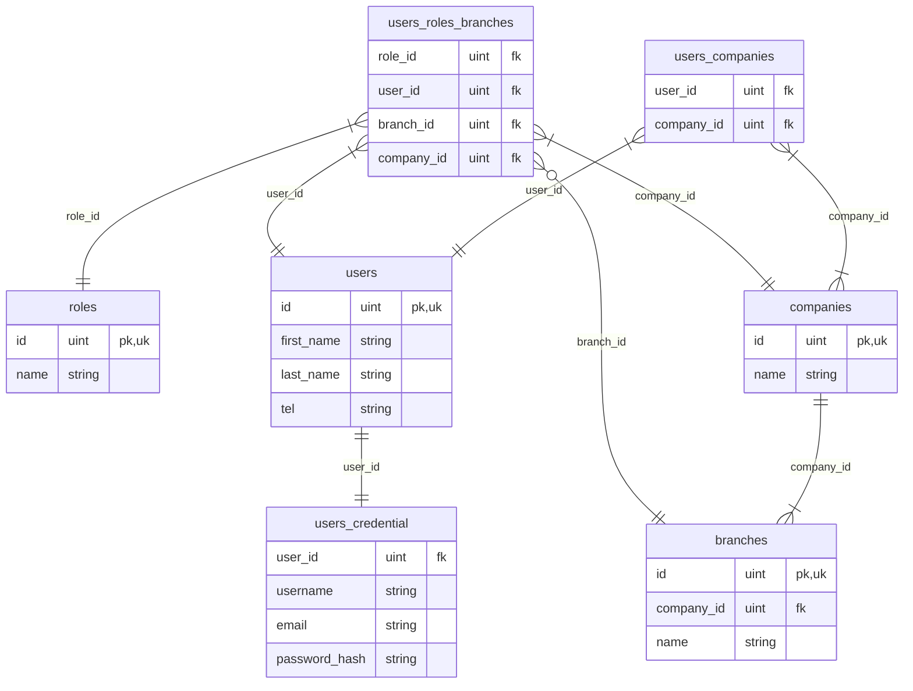

# Database Relation

## Users Flow

```mermaid
erDiagram
    roles {
        id uint pk,uk
        name string
    }

    companies {
        id uint pk,uk
        name string
    }

    branches {
        id uint pk,uk
        company_id uint fk
        name string
    }

    companies ||--|{ branches : company_id

    users_companies {
        user_id uint fk
        company_id uint fk
    }
    users_companies }|--|| users : user_id
    users_companies }|--|{ companies : company_id

    users {
        id uint pk,uk
        first_name string
        last_name string
        tel string
    }

    users_credential {
        user_id uint fk
        username string
        email string
        password_hash string
    }

    users ||--|| users_credential : user_id

    users_roles_branches {
        role_id uint fk
        user_id uint fk
        branch_id uint fk
        company_id uint fk
    }
    users_roles_branches }|--|| users : user_id
    users_roles_branches }|--|| roles : role_id
    users_roles_branches }o--|| branches : branch_id
    users_roles_branches }|--|| companies : company_id
```
